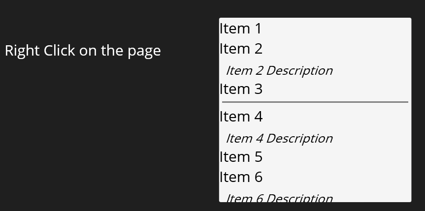

# PopupListView
Demonstrates a sizing issue with SfPopup with setting the ContentTemplate to an SfListView

The goal is to display an SfPopup with a ContentTemplate containing an SfListView and no footer or header.
- SfListView should be sized to fit its content (AutoFitMode=Height)
- SfPopup should be sized to fit the its content (AutoSizeMode = PopupAutoSizeMode.Height)
- ShowHeader and ShowFooter are set to false on the SfPopup

## Expected Behavior
The SfPopup should be sized to fit the SfListView content.

## Actual Behavior
SfListView does not set a HeightRequest that matches the height of its content. 
This causes the SfPopup to be sized incorrectly.

*NOTE:* I've seen this behavior before with SfComboBox and it proved quite expensive to work around the 
issue; essentially requiring a parallel implmentation to measure the listview items and
setting MaxDropdownHeight.

## Steps to Reproduce
Launch the app and right-click on the main page. The execution path is through MainPage.ShowMenu.

## Attempted Workaround 1: Use the standard Maui ListView instead of SfListView. 
This works as expected but the BindingContext issue I first encountered with ListView is still present.
*FWIW*: This is the reason I switched to SfListView in the first place.

## Attempted Workaround 2: Use a custom SfListView

Since I control the embedded SfListView, I attempted to workaround the by deriving a custom ListView
class that could measure its content and set HeightRequest accordingly. 

The approach I took was as follows:
- Derive a custom ListView class from SfListView
- Use a custom ListViewItemsGenerator to return a custom ListViewItem
- Derive a custom ListViewItem class from ListViewItem
  - Register itself with the ListView class when the BindingContext is initially set or changes
  - Override MeasureContent to cache the result of the base implementation.

*NOTE:* My intent was to override MeasureOverride on both the ListView and ListViewItem classes;
however, both classes seal MeasureOverride so I overrode MeasureContent instead.

The problem with this approach is that the MeasureContent method is called before 
the ListViewItems are created and not called after.

As a result SfListView.MeasureContent is called with default values for widthConstraint (Popup.PopupViewWidth:312)
and heightConstraint (Popup.AppliedBodyHeight:176) and returns a size with these values and WidthRequest
and HeightRequest are set to these values as well. My derived class cannot override this because 
ListViewItem.MeasureContent doesn't occur until later.

*NOTE:* I see the actual item population occurs via Syncfusion.Maui.ListView.VisualContainer.MeasureContent() which
calls EnsureItems.  SfListView.MeasureContent does not call this path and returns the default layout information.

I suspect this may be the underlying issue with SfComboBox as well. I ended up having to manually 
measure the list view items to set MaxDropDownHeight even though IsAutoFit was set to true.
I would like to avoid that cost here as well.

Here are ComboxBox issue:
[Layout regression in SfComboBox when using an ItemTemplate with variable-sized items](https://support.syncfusion.com/support/tickets/616587)
[MaxDropDownHeight is expensive to calculate](https://support.syncfusion.com/support/tickets/617849)
